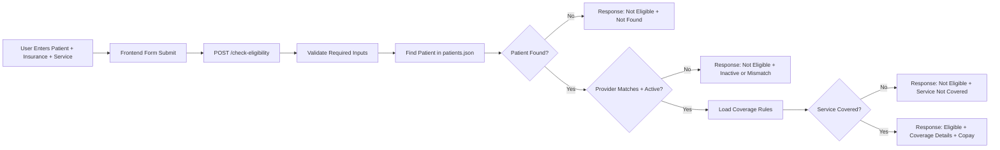

# Flow Diagram

```mermaid
flowchart LR
    A[User Enters Patient + Insurance + Service] --> B[Frontend Form Submit]
    B --> C[POST /check-eligibility]
    C --> D[Validate Required Inputs]
    D --> E[Find Patient in patients.json]
    E --> F{Patient Found?}
    F -- No --> Z[Response: Not Eligible + Not Found]
    F -- Yes --> G{Provider Matches + Active?}
    G -- No --> Y[Response: Not Eligible + Inactive or Mismatch]
    G -- Yes --> H[Load Coverage Rules]
    H --> I{Service Covered?}
    I -- No --> X[Response: Not Eligible + Service Not Covered]
    I -- Yes --> W[Response: Eligible + Coverage Details + Copay]
```
